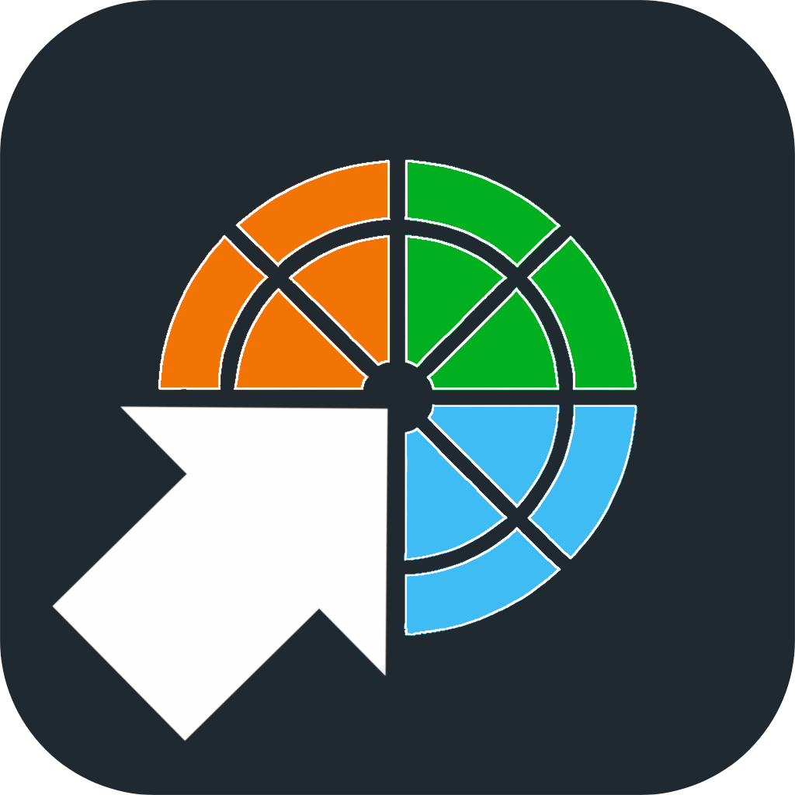
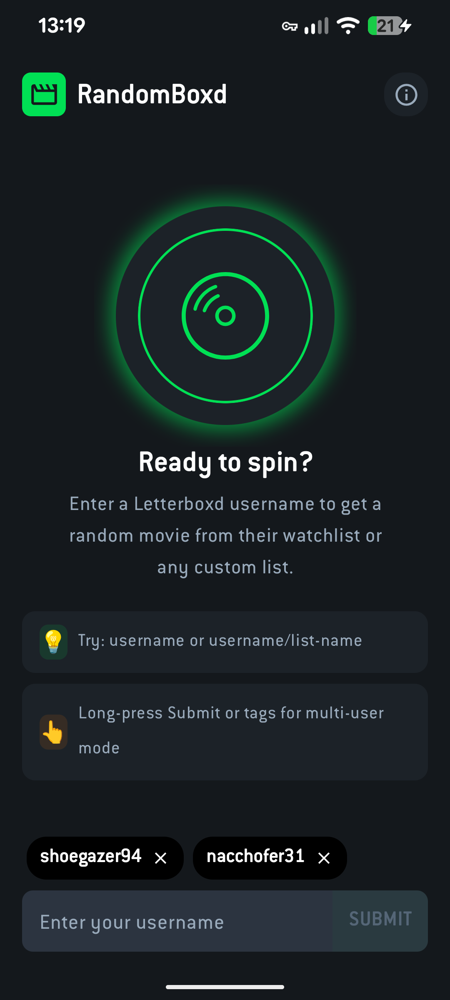
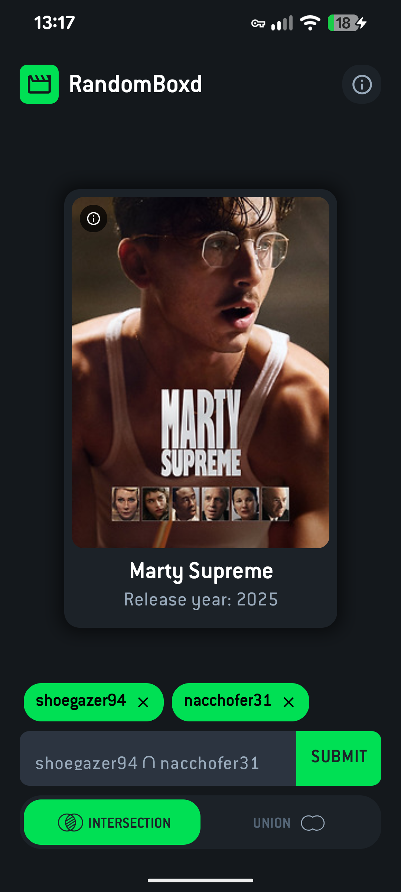
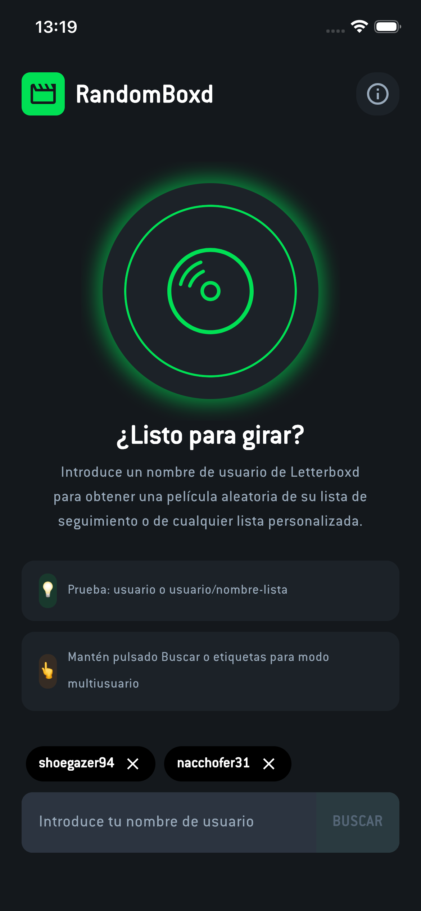
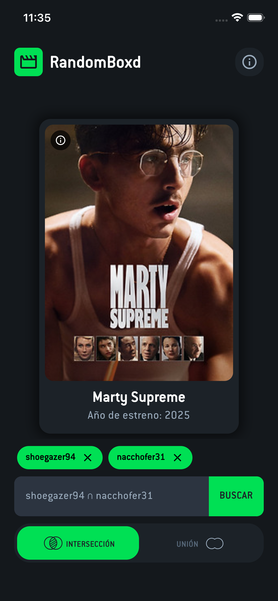
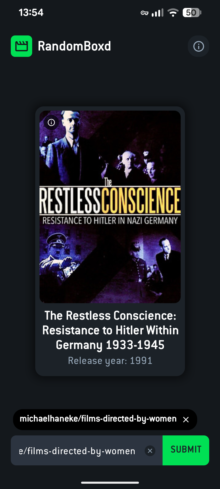
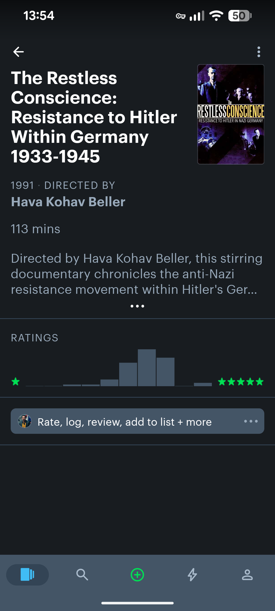

# 🎥 RandomBoxd 🍿


<p align="center">
  
</p>

RandomBoxd is a **Kotlin Multiplatform** project designed to fetch a random movie from a Letterboxd user's **watchlists** or **custom lists**. This app is built for **Android** and **iOS** devices. 📱🎬

## ✨ Features
- 🎲 Fetch a random movie from a Letterboxd user's **watchlist** or **custom lists**.
- 📱 Supports **Android** and **iOS** platforms.
- 🔗 Seamless deep linking with the **Letterboxd** app.
- 🔍 Intuitive user search functionality.

## 🏗️ Project Architecture
This project follows the **Clean Architecture** principles to ensure a scalable and maintainable codebase.

### 🏛️ KMP Structure
- **`/composeApp`** is for code that will be shared across your **Compose Multiplatform** applications.
  - `commonMain` contains code common for all targets.
  - Other folders include platform-specific code (e.g., `iosMain` for iOS-specific code like **CoreCrypto** integration).

- **`/iosApp`** contains iOS applications.
  - Even if you're sharing UI with **Compose Multiplatform**, this folder is the **entry point** for the iOS app.
  - This is also where you can add **SwiftUI** code if needed.

## 🌍 Localization Support

RandomBoxd is built with **full localization support**, allowing the app to be translated into **any language**.
- 🏳️ Uses Kotlin Multiplatform's localization tools for seamless translations.
- 📝 Supports dynamic text updates based on user preferences.
- 🌐 Easily adaptable for different regions and languages.


## 📸 Screenshots

### 🤖 Android
<p align="center">
  
  
</p>

### 🍏 iOS
<p align="center">
  
  
</p>

### 🔍 Search user lists & Deeplinking
<p align="center">
  
  
</p>

## 🔧 Tech Stack
- **Kotlin Multiplatform Mobile (KMM)** - Shared logic for Android and iOS.
- **Jetpack Compose** - UI for Android.
- **SwiftUI** - UI for iOS.
- **Ktor** - Network requests.
- **Coroutines & Flow** - Asynchronous programming.
- **SQLDelight** - Local database.
- **Koin** - Dependency Injection.
- **Coil** - Image loading.
- **Navigation Compose** - Jetpack Compose navigation.
- **Kotlinx Serialization** - JSON serialization.
- **Spotless** - Code formatting.

## 🚀 Getting Started
1. Clone the repository:
   ```sh
   git clone https://github.com/your-repo/randomboxd.git
   ```
2. Open the project in **Android Studio (latest version with KMM plugin)**.
3. Run on an **Android Emulator** or an **iOS Simulator**.
4. Start selecting random movies from Letterboxd lists! 🎞️

## 🤝 Contributing
Feel free to **open issues** or **submit pull requests** to improve the project. 🛠️

## 📜 License
This project is licensed under the **MIT License**.

---
Enjoy **RandomBoxd** and never struggle to pick a movie again! 🎬🍀